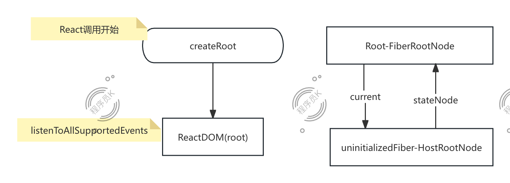

# React 源码全景解析

Hello 大家好， 我是程序员Knight。详细阅读React源码一直是想做的事情，之前由于自己的内阻力问题，一直拖延到现在。现在我想好好阅读下并总结成一个系列文章，我将采用从顶向下的顺序，全局预览React源码到每个细节分析，来分享我对于React源码的理解，希望能对每一个React开发工程师有帮助。那么闲话少说，让我们进入到第一篇的学习 React源码全景分析。

在本篇分享中，我将通过对React源码18.2.0的分析来解析：
- 源码目录结构分析
- 核心架构一览（Scheduler, Reconciler, Renderer）
- 4大核心流程分析：
  - Trigger
  - Schedule
  - Render
  - Commit
这三点，希望阅读后，大家能够掌握其基本原理，并能在进行React编码过程中，在脑海中构造一个VDOM树。


## （是否出现在文章中？） 源码仓库文件夹 React 源码 packages文件夹下的子文件夹分析

当我们开始阅读React源码时，我们通常会进入到`packages` 文件夹下， 里面共有36个子文件夹（基于react 18.2.0）（通过 `ls -1 | wc -l` ）。我们可以将这36个文件夹分类为4大类：
- 核心流程包：
  1. `react` : 核心React库， 提供了诸如`React.createElemnt、 React Hooks和组件` 等API。
  2. `react-dom` ：提供了React与浏览器DOM交互的功能，包含了 `ReactDOM.render` 等API。
  3. `react-native-renderer` ： 用于原生环境的React渲染器，用于适配与原生元素交互的协调过程。
  4. `react-reconciler` ： React核心引擎， 提供了Diff算法的过程，通常与 `react-dom 或 react-native-renderer` 一起使用。
  5.  `scheduler` : 一个独立的包，用于管理 React 更新的调度。它是一个协作调度程序，可以帮助 React 协调渲染，而不会不必要地阻塞主线程。 React 协调器在底层使用它来确定更新的优先级。
- 开发与测试包：
  1. `react-devtools, react-devtools-core, react-devtools-extensions, react-devtools-inline, react-devtools-shared, react-devtools-shell, react-devtools-timeline`: 这些包构成了 React DevTools 生态系统。它们提供浏览器扩展、共享组件和 DevTools 功能的其他层，帮助开发人员检查 React 组件树、挂钩和性能特征。
  2. `react-debug-tools` ： 提供 debug API，使您可以更轻松地检查 React 组件的内部状态和树以进行调试和测试。
  3. `react-suspense-test-utils`: 用于测试与 Suspense 相关的功能的实用程序，允许您模拟和验证加载状态和异步渲染行为。
  4. `dom-event-testing-library, jest-mock-scheduler, jest-react`: 帮助测试 React 组件和功能的实用程序。例如，dom-event-testing-library有助于在React环境中模拟和测试DOM事件，而jest-mock-scheduler则由React自己的测试套件在内部使用。
  5. `react-test-renderer`: 允许您将 React 组件渲染为 JSON 表示形式而不是浏览器 DOM，从而更轻松地创建可预测的测试和快照测试。
  6. `react-client` : 支持 React 的服务器组件并改进了服务器渲染功能。
  7. `react-noop-renderer` : 用于测试React协调过程与调度的库。
- 试验包:
  1. `react-art` : 将 React 与矢量图形的 ART 库集成。
  2. `react-cache` ： 用于探索缓存机制以支持 Suspense 获取数据。
  3. `react-fetch, react-fs, react-pg`： 实验包探索以 React 友好的方式与网络请求、文件系统读取或其他特定于平台的数据获取的集成。
  4. `react-interactions` ： 实验性事件/交互系统包，探索高级事件处理和用户交互模式。
  5. `react-server, react-server-dom-relay, react-server-dom-webpack, react-server-native-relay`: 这些包是 React Server Components 实验工作的一部分，直接在服务器上集成 React 渲染并使用不同的数据获取和捆绑策略（例如，使用 Relay 或 Webpack）。
- 工具包:
  1. `eslint-plugin-react-hooks` : ESLint 插件强制执行 Hooks 规则，通过分析代码模式确保正确使用 Hooks。
  2. `react-is` : 提供一组实用程序来识别和检查 React 元素、片段类型、门户等。
  3.  `use-subscription, use-sync-external-store` :  旨在将外部数据源或存储与 React 渲染周期集成的钩子。 use-sync-external-store 被用作 React 推荐模式的一部分，用于在并发模式下安全地读取外部存储。
  4.  `shared` : 多个 React 包使用的常见内部实用程序、常量和辅助函数。这段代码通常不适合公众使用，但有助于在 React 的不同部分保持通用逻辑 DRY（不要重复自己）。
  5.  `react-refresh` : 优化版本的 HMR 

## 核心流程一览（Trigger，Schedule, Render, Commit）
在React中，一个从更新到展示一共分为4个阶段，分别是：
- 触发阶段 Trigger： 在这个阶段中的主要任务为 ”通知部分应用需要渲染“，在这个阶段，更像是创建一个任务，并在之后将任务交给调度器处理。比如在初始化React应用时，会通过 `ReactDOM.render` 或者 `setState()` 来触发渲染。
- 调度阶段 Schedule：在这个阶段，React会通过其内部实现的优先队列（Priority Queue）与任务优先级来处理”待处理的任务“。
- 渲染阶段 Render：通过 Diff算法 来计算出新的Fiber（WIP）树与当前Fiber树的区别，并将需要处理的更新应用到真实DOM上。
- 提交阶段 Commit：处理需要被更新的内容到真实DOM中，并处理所有的Effects（副作用）。

在这几个阶段中，一共三个比较重要的部分发挥着作用，分别是调度器（Scheduler）、协调器（Reconciler）、渲染器（Renderer）：

1️⃣ Scheduler 调度器：主要是用来**管理更新优先级**，调度器（Scheduler）通过优先级调度、任务切片（time slicing）、支持任务中断与恢复达到了高优任务先执行的特性。确保了UI更新更顺畅，避免了长时间任务的堵塞

2️⃣ Reconciler 协调器：主要是用来**计算并更新UI组件树**，协调器（Reconciler）通过双缓存技术、任务拆分与调度、Diff算法实现了可中断渲染、自动批量更新、并发模式地高效更新UI。

3️⃣ Renderer 渲染器：主要负责**将React Fiber树转换为目标环境可展示的UI**，渲染器（Renderer）在不同的宿主环境中存在着不同的版本来适应对应的宿主环境，负责在React内部Commit阶段将已经生成的DOM节点挂载到根节点下来展示给用户。


<!-- - Scheduler 调度器：将更新任务的
  - 职责：
    - 任务优先级管理：根据定义好的任务紧急程度，动态调整执行顺序。
    - 时间切片：将一个长任务分割为多个微任务，避免主线程堵塞。
    - 任务的中断与恢复：通过浏览器空闲时间执行低优先级任务

- Reconciler 协调器：
  - 职责：
    - 双缓存技术：维护当前树（Current Tree）和工作树（WorkInProgress Tree），实现无卡顿的异步渲染。
    - Diff算法：通过 Fiber 架构的链表结构，实现可中断的虚拟 DOM 差异计算。
    - Effect标记：生成副作用链表（如插入、更新、删除），描述具体需要渲染的变更。

- Renderer 渲染器：
  - 职责：
    - 平台渲染：将 Reconciler 计算的变更应用到具体环境（如 DOM API 或 Native 组件）。
    - 渲染优化：批量更新（Batching）、差异提交（Commit Phase）避免中间状态闪烁。 -->

## 全流程一览：

我们通常在React项目中都会通过这样的语法来初始化React应用：
```javascript
import { createRoot } from 'react-dom/client';
import React from 'react';

import App from './App';

const reactRoot = document.querySelector('#app');

const root = createRoot(reactRoot);
root.render(<App />);
```

在React中，这段代码涉及到两个部分：
- `createRoot` 初始化ReactDOM对象
- `render(<App key={'app'} />);` : mount React应用

### 初始化 createRoot：


初始化一共做了这三件事：

1️⃣：树结构：
初始化React树结构（FiberRootNode 与 HostRootNode）， 
- FiberRootNode 用来管理整个 `Fiber` 树
  ```markdown
  FiberRootNode
  ├── current (指向当前 UI 的 Fiber 树)
  ├── workInProgress (指向正在渲染的新 Fiber 树)
  ```
-  初始化 `HostRootFiber` 的更新队列

**不发表部分**:

创建 FiberRootNode
```javascript
function FiberRootNode(containerInfo, tag, hydrate, identifierPrefix, onRecoverableError) {
  this.tag = tag;
  this.containerInfo = containerInfo;
  this.pendingChildren = null;
  this.current = null;
  this.pingCache = null;
  this.finishedWork = null;
  this.timeoutHandle = noTimeout;
  this.context = null;
  this.pendingContext = null;
  this.callbackNode = null;
  this.callbackPriority = NoLane;
  this.eventTimes = createLaneMap(NoLanes);
  this.expirationTimes = createLaneMap(NoTimestamp);
  this.pendingLanes = NoLanes;
  this.suspendedLanes = NoLanes;
  this.pingedLanes = NoLanes;
  this.expiredLanes = NoLanes;
  this.mutableReadLanes = NoLanes;
  this.finishedLanes = NoLanes;
  this.entangledLanes = NoLanes;
  this.entanglements = createLaneMap(NoLanes);
  this.identifierPrefix = identifierPrefix;
  this.onRecoverableError = onRecoverableError;
}
```

创建HostRoot Fiber
```javascript
function FiberNode(tag, pendingProps, key, mode) {
  // Instance
  this.tag = tag;
  this.key = key;
  this.elementType = null;
  this.type = null;
  this.stateNode = null; // Fiber

  this.return = null;
  this.child = null;
  this.sibling = null;
  this.index = 0;
  this.ref = null;
  this.pendingProps = pendingProps;
  this.memoizedProps = null;
  this.updateQueue = null;
  this.memoizedState = null;
  this.dependencies = null;
  this.mode = mode; // Effects

  this.flags = NoFlags;
  this.subtreeFlags = NoFlags;
  this.deletions = null;
  this.lanes = NoLanes;
  this.childLanes = NoLanes;
  this.alternate = null;
}
```


2️⃣：React 事件代理:
React会对传入的DOM元素（id=root）进行事件代理，在内部会对事件集（例如click、 drag、contextMenu等）进行监听（通过addEventListener）。之后在我们使用 `onClick` 事件时，React并不会真正的把事件绑定到对应的DOM元素上，而是通过上述代理的方式在React内部找到对应的事件回调进行执行与触发。

3️⃣： 初始化ReactDOM并返回，ReactDOM中只有一个 `_internalRoot` 属性用来记录当前FiberRootNode，其 `prototype` 上有两个函数分别为 `render` 函数与`unmount` 函数

```javascript
function ReactDOMRoot(internalRoot) {
  this._internalRoot = internalRoot;
}

ReactDOMHydrationRoot.prototype.render = ReactDOMRoot.prototype.render = function (children) {
}

ReactDOMHydrationRoot.prototype.unmount = ReactDOMRoot.prototype.unmount = function () {
}
```


### 更新
当初始化结束后，就进入到更新阶段，更新又分为初始化更新与触发更新。初始化更新为 `ReactDOM.render` 而 触发更新则由 `state` 发生变化而触发。

#### 初次更新


##### Trigger 阶段
在React初次更新时, 由用户主动调用 `render` 函数来触发，用户需要将渲染的组件传给 `render` 函数。

render： 根节点（FiberRootNode）与 将要渲染的子元素（children/App component）

updateContainer: 
- 获取 HostRoot（current$1）、时间、更新车道（用于调度系统。）、创建更新对象（记录了 payload、callback、next 等信息，用于最后在 render 阶段计算新的 state。），
- 调用 `enqueueUpdate`: 获取HostRoot中的 UpdateQueue 与 UpdateQueue中的shared（在初始化的时候初始了 `fiber.updateQueue`）之后调用 `enqueueConcurrentClassUpdate(fiber, sharedQueue, update, lane)` 初始化 循环链表 `interleaved` （可中断更新链表）之后调用 `markUpdateLaneFromFiberToRoot(fiber, lane);` 来标记树中的内容代更新。 （这里通过循环链表来实现原因在于 ***合并更新、批量处理更加容易：React 可以在渲染结束后，一次性将这个循环更新队列合并到真正的 pending 队列里（在 commit 或 render 结束时）。 *** ）
- 调用 `scheduleUpdateOnFiber(root, current$1, lane, eventTime);`: 
  - 调用 `markRootUpdated(root, lane, eventTime);` 初始化 root的 `pendingLanes(root.pendingLanes |= updateLane;)、suspendedLanes、pingedLanes、eventTimes`，
  - 调用 `ensureRootIsScheduled(root, eventTime);` 预示着调度开始: 
    - 调用 `markStarvedLanesAsExpired(root, currentTime);`: 检查是否有过期
    - 调用 `getNextLanes(root, root === workInProgressRoot ? workInProgressRootRenderLanes : NoLanes);` 获取下一个更新优先级集合
    - 调用 `getHighestPriorityLane(nextLanes)`： 找到优先级集合中最右侧的1（最高优先级）-> 会检测当前是否Scheduler中的任务与这个任务优先级相同。
    - 判断最高优先级是否为：
      - SyncLane：
        - 如果最高优先级为SyncLane，例如点击事件中的setState
          - 首先调用 `scheduleSyncCallback` 将 `performSyncWorkOnRoot` 放入 `syncQueue`
          - 调用 `scheduleMicrotask`(在浏览器环境中为promsie) 调用 `flushSyncCallbacks` 并触发 `performSyncWorkOnRoot`
      - 其他：
        - 计算出优先级并调用调度器的 `scheduleCallback` 调度 `performConcurrentWorkOnRoot`
- 调用 `entangleTransitions(root, current$1, lane);`


##### Schedule 阶段
在这里如果任务为可中断时，则通过调度器来进行任务处理，调度器负责任务的调度、优先级管理、时间切片。

这里一共有两个区分点：
- 如果优先级为 `Synclane`: 则通过 `scheduleMicrotask` 微任务的方式执行 `performSyncWorkOnRoot`
- 其他的话：
  - 调用 调度器中的 scheduleCallback
  - 调度器会通过 优先级队列 进行任务队列管理和定时任务队列管理。
  - 简单来说，每次会把最高优先级的任务拿出来执行。

调度器整个流程：


##### Render 阶段
还未正式标志进入render阶段前的函数：
**performConcurrentWorkOnRoot**
- 规则判断：
  - 当前运行上下文不能在 `renderContext` 或 `commitContext`， 如果存在则报错
  - 是否存在 `passiveEffects` 如果存在并且没有任务时，则直接退出。
- 调用 `getNextLanes` 获取当前更新优先级
- 如果当前优先级 既不是 `blockingLane` 也不是 `expiredlane` 时 调用 `renderRootConcurrent` 否则调用 `renderRootSync`
- 获取render结果：
  - `RootErrored`： 重试机制
  - `RootFatalErrored`: 重大错误
  - `RootDidNotComplete`: concurrent render
  - `其他/RootCompleted`：调用 `finishConcurrentRender` 准备进入 `commit` 阶段
- 调用 `ensureRootIsScheduled(root, now());`
- 如果 `root.callbackNode === originalCallbackNode`, 调用 `performConcurrentWorkOnRoot`


**performSyncWorkOnRoot**
- 规则判断
  - 当前运行上下文不能在 `renderContext` 或 `commitContext`， 如果存在则报错
  - `flushPassiveEffects` 
- 调用 `getNextLanes` 获取当前更新优先级
- 调用 `renderRootSync`, 当结束结果为：
  - `RootErrored`: 重试机制
  - `RootFatalErrored`:
  - `RootDidNotComplete`: 错误
  - `RootCompleted`:
    ```javascript
    var finishedWork = root.current.alternate;
    root.finishedWork = finishedWork;
    root.finishedLanes = lanes;
    commitRoot(root, workInProgressRootRecoverableErrors, workInProgressTransitions); 
    ```
- `ensureRootIsScheduled(root, now());` 

当调用到 `renderRootConcurrent/renderRootSync`则标志着进入到render阶段中

我们首先来看 `renderRootSync()`:
- `workInProgressRoot !== root || workInProgressRootRenderLanes !== lanes`： 检查当前正在渲染的 Fiber 树是否已经发生了变化，如果变化了，就可能需要重新开始渲染。如果需要重新渲染，则调用 `prepareFreshStack(root, lanes);` 生成 WIP
  - `prepareFreshStack(root, lanes)`
- 调用 `workLoopSync()`
- 结束 render上下文并回退全局变量到之前的状态
- 返回 `workInProgressRootExitStatus` 

接下来我们来看React render过程中的重要函数： `workLoopSync`
workLoopSync 主要不断检测 `workInProgress` 并执行 `performUnitOfWork(workInProgress);`

```javascript
function workLoopSync() {
  while (workInProgress !== null) {
    performUnitOfWork(workInProgress);
  }
}
```

**performUnitOfWork(workInProgress)**
从 `performUnitOfWork` 开始，则开始处理 Diff 过程。


整个函数的遍历流程如下函数：从传参进来的 `unitOfWork/全局变量WorkInProgress` 从顶向下遍历，
```javascript
function performUnitOfWork(unitOfWork) { // unitOfWork === workInProgress
  var current = unitOfWork.alternate;
  var next;

  next = beginWork(current, unitOfWork, subtreeRenderLanes);
  unitOfWork.memoizedProps = unitOfWork.pendingProps;

  if (next === null) {
    completeUnitOfWork(unitOfWork);
  } else {
    workInProgress = next;
  }
}
```
整个Render阶段做的事情可以整理为三件：
1️⃣ 生成当前React Element对应的Fiber树。
2️⃣ 为Fiber树进行打标（placement/deletion/update）
3️⃣ 在CompleteWork结束后，生成Fiber树对应的真实DOM树

// TODO：
简单的延伸：
- FunctionComponent会在这个阶段进行调用
- Reconciler

**TL；DR**
如果大家有兴趣，我会把React源码做成一个系列，并详细分析React每处改动，

**beginWork**

**completeWork**
 


##### Commit 阶段

当Render结束后，会进入到React的Commit阶段，

**commitRoot(root, workInProgressRootRecoverableErrors, workInProgressTransitions);**:
- flushPassiveEffects()
- `executionContext |= CommitContext` 标志着进入到Commit阶段

**commitMutationEffects(root, root.finishedWork, lanes);**


#### 触发更新

