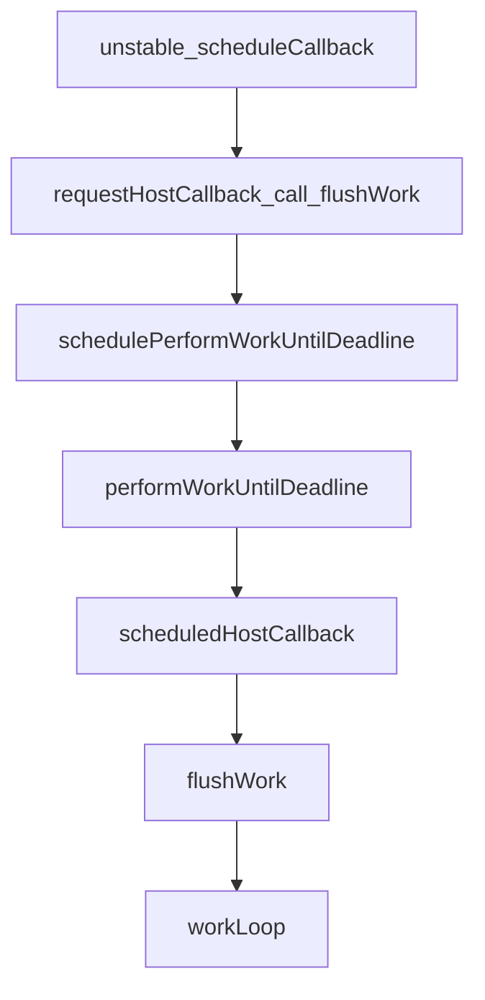

# React Scheduler 如何工作的

React Scheduler 和 MQ的工作原理很像，将任务变为异步处理。


## 前置知识：
#### 优先队列 — priority queue
React使用优先队列进行调度任务管理，它会将任务进行分级，高优先级的任务会进行（比如用户交互），低优先级的任务会稍后执行。

优先队列是一种特殊的队列数据结构，每个在队列中的元素有特殊的优先级的值，会根据优先级进行排序。React中的优先队列使用数组来表示。并提供了添加（push）、删除（pop）、peek的操作：
- push：将新的任务加入到优先队列的底部，再进行 `shiftUp` 的操作
- pop：删除 `root` 元素（高优先级任务），再进行 `shiftdown` 的操作
- peek：返回当前最高优先级的元素
- compare 函数：首先对比 `sortIndex` 再对比 `taskId` 

核心优先队列代码：

```javascript
var taskQueue = [];
var timerQueue = [];

function push(heap, node) {
  var index = heap.length;
  heap.push(node);
  siftUp(heap, node, index);
}
function peek(heap) {
  return heap.length === 0 ? null : heap[0];
}
function pop(heap) {
  if (heap.length === 0) {
    return null;
  }

  var first = heap[0];
  var last = heap.pop();

  if (last !== first) {
    heap[0] = last;
    siftDown(heap, last, 0);
  }

  return first;
}

function siftUp(heap, node, i) {
  var index = i;

  while (index > 0) {
    var parentIndex = index - 1 >>> 1;
    var parent = heap[parentIndex];

    if (compare(parent, node) > 0) {
      // The parent is larger. Swap positions.
      heap[parentIndex] = node;
      heap[index] = parent;
      index = parentIndex;
    } else {
      // The parent is smaller. Exit.
      return;
    }
  }
}

function siftDown(heap, node, i) {
  var index = i;
  var length = heap.length;
  var halfLength = length >>> 1;

  while (index < halfLength) {
    var leftIndex = (index + 1) * 2 - 1;
    var left = heap[leftIndex];
    var rightIndex = leftIndex + 1;
    var right = heap[rightIndex]; // If the left or right node is smaller, swap with the smaller of those.

    if (compare(left, node) < 0) {
      if (rightIndex < length && compare(right, left) < 0) {
        heap[index] = right;
        heap[rightIndex] = node;
        index = rightIndex;
      } else {
        heap[index] = left;
        heap[leftIndex] = node;
        index = leftIndex;
      }
    } else if (rightIndex < length && compare(right, node) < 0) {
      heap[index] = right;
      heap[rightIndex] = node;
      index = rightIndex;
    } else {
      // Neither child is smaller. Exit.
      return;
    }
  }
}

function compare(a, b) {
  // Compare sort index first, then task id.
  var diff = a.sortIndex - b.sortIndex;
  return diff !== 0 ? diff : a.id - b.id;
}
```

React scheduler 中主要通过 timerQueue 和 taskQueue


#### 事件循环； 宏任务与微任务

#### JS中的时间：
- 异步方法：`setTimeout, setImmediate, messageQueue`
- 时间记录方法: performance vs. Date.now:
  在 `Scheduler` 源码中，有一个函数命名为`getCurrentTime()`, ***React通过该函数来给任务添加时间戳，来计算它们的运行时间；并决定是放弃还是继续渲染。*** 我们可以看到 React 用到了当前的时间，如果浏览器支持 `performance` 对象时，React会使用 `performance.now()` API来获取当前时间戳相反则是 `Date.now()`。

  **为什么偏向 performance.now?**:
  1. 更高的精度： `Performance.now()` 提供了亚毫秒级的精度，而 `Date.now()` 仅提供毫秒精度，如果系统时钟更新（例如，通过网络时间协议），`Date.now()` 会跟着变动。 
  2. 单调性， `perfoamnce.now` 为单调递增，之后的task的时间一定会大于前一个task。


  **实战技巧（时间戳碰撞问题（timestamp collisions）：**
  在我们日常前端开发时，如果我们以时间戳来进行唯一key或id时， `performance.now()` 的精度为亚毫秒级，对比 `Date.now()` 会是更好的选择：

  ```javascript
  for (let index = 0; index < 5; index++) { // 运行时间的原因，Date.now 会产生时间碰撞。
      console.log(Date.now())
  }

  /**
   * 1734454128602
   * 1734454128616 -> 相同
   * 1734454128616 -> 相同
   * 1734454128616 -> 相同
   * 1734454128616 -> 相同
   */

  ```

#### 其他：
- try...finally
- 


#### React Scheduler 中的常量：

- **任务优先级常量**：
  ```javascript
  var ImmediatePriority = 1;
  var UserBlockingPriority = 2;
  var NormalPriority = 3;
  var LowPriority = 4;
  var IdlePriority = 5;
  ```
- **超时常量**:
  ```javascript
    // Times out immediately
  var IMMEDIATE_PRIORITY_TIMEOUT = -1;
  // Eventually times out
  var USER_BLOCKING_PRIORITY_TIMEOUT = 250;
  var NORMAL_PRIORITY_TIMEOUT = 5000;
  var LOW_PRIORITY_TIMEOUT = 10000;
  // Never times out
  var IDLE_PRIORITY_TIMEOUT = maxSigned31BitInt;
  ```
- 

### scheduler 做了什么：

#### 流程：



#### 函数分析
`performaConcurrentWorkOnRoot()` 在中断情况下，返回一个闭包函数。Scheduler 则会恢复resume返回的任务的回调函数来确认如果能够继续。


##### `unstable_scheduleCallback` (scheduleCallback)： 
- 通过过期时间来调度任务。`expirationTime` (代表优先级)
`scheduleCallback()` :
- 为了能够调度任务（task），它将任务存放在优先队列里
- 通过 `expirationTime` 来记录任务优先级， 越早过期，越早处理。(计算方式： 开始时间+根据优先级定义的超时时间)
- 判断被加入的任务的执行时机：
  - 延迟情况(`startTime > currentTime`)：
    - 说明任务设置了 delay，因此需要放入 timerQueue（延时队列）。
    - sortIndex 设置为任务的 startTime，确保延时任务按照其启动时间排序。
    - 检查是否需要调度一个新的超时回调：
      - 如果没有其他任务需要立即执行，且当前任务是 timerQueue 中延迟最短的任务，则：
        - 取消已存在的超时回调（如果存在）。
        - 安排一个新的超时回调，延迟时间为 startTime - currentTime。
  - 任务可以立即执行：将任务加入任务队列，并安排一个主机回调
    - startTime 小于或等于当前时间，任务没有延迟，立即放入 taskQueue（任务队列）。
    - 设置 sortIndex 为任务的 expirationTime，确保任务按到期时间排序。
    - 如果启用了 enableProfiling，记录任务的开始时间，并标记任务为排队状态。
    - 检查是否需要调度主机回调：
      - 如果当前没有主机回调正在调度且没有在执行任务，则安排一个主机回调，调用 flushWork 执行任务。


```javascript
function unstable_scheduleCallback(priorityLevel, callback, options) {
  var currentTime = getCurrentTime();

  var startTime;
  if (typeof options === 'object' && options !== null) {
    var delay = options.delay;
    if (typeof delay === 'number' && delay > 0) {
      startTime = currentTime + delay;
    } else {
      startTime = currentTime;
    }
  } else {
    startTime = currentTime;
  }

  var timeout;
  switch (priorityLevel) {
    case ImmediatePriority:
      timeout = IMMEDIATE_PRIORITY_TIMEOUT;
      break;
    case UserBlockingPriority:
      timeout = USER_BLOCKING_PRIORITY_TIMEOUT;
      break;
    case IdlePriority:
      timeout = IDLE_PRIORITY_TIMEOUT;
      break;
    case LowPriority:
      timeout = LOW_PRIORITY_TIMEOUT;
      break;
    case NormalPriority:
    default:
      timeout = NORMAL_PRIORITY_TIMEOUT;
      break;
  }

  var expirationTime = startTime + timeout;

  //  创建任务
  var newTask = {
    id: taskIdCounter++,
    callback,
    priorityLevel,
    startTime,
    expirationTime,
    sortIndex: -1,
  };
  if (enableProfiling) {
    newTask.isQueued = false;
  }

  if (startTime > currentTime) {
    // This is a delayed task.
    newTask.sortIndex = startTime;
    push(timerQueue, newTask); // 将任务推送到优先队列中
    if (peek(taskQueue) === null && newTask === peek(timerQueue)) {
      // All tasks are delayed, and this is the task with the earliest delay.
      if (isHostTimeoutScheduled) {
        // Cancel an existing timeout.
        cancelHostTimeout();
      } else {
        isHostTimeoutScheduled = true;
      }
      // Schedule a timeout.
      requestHostTimeout(handleTimeout, startTime - currentTime);
    }
  } else {
    newTask.sortIndex = expirationTime;
    push(taskQueue, newTask);
    if (enableProfiling) {
      markTaskStart(newTask, currentTime);
      newTask.isQueued = true;
    }
    // Schedule a host callback, if needed. If we're already performing work,
    // wait until the next time we yield.
    if (!isHostCallbackScheduled && !isPerformingWork) {
      isHostCallbackScheduled = true;
      /** 
       * requestHostCallback(flushWork) 是必要的，因为 Scheduler 与主机无关，它应该只是一些可以在
       * 何主机上运行的独立黑匣子，因此需要请求它。
       * */
      requestHostCallback(flushWork); // 处理任务
    }
  }

  return newTask;
}
```


##### requestHostCallback:
- 设置全局变量 `scheduledHostCallback`
- 如果当前没有任务在跑，调用 `schedulePerformWorkUntilDeadline` 

##### schedulePerformWorkUntilDeadline
- schedulePerformWorkUntilDeadline函数会根据运行环境和浏览器API支持切换三种形式：
  - setImmediate(performWorkUntilDeadline)
  - message channel(performWorkUntilDeadline)
  - setTimeout(performWorkUntilDeadline)

##### performWorkUntilDeadline
- 负责在一定时间内执行任务并在任务未完成时安排后续的任务执行。这种机制是 React 的调度器用来确保任务执行不会长时间阻塞主线程，从而提高用户界面的流畅度。
- 检查 `scheduledHostCallback` 是否为空（在requestHostCallback中有设置全局变量）

```javascript
const performWorkUntilDeadline = () => {
  if (scheduledHostCallback !== null) {
    /**
     * currentTime: 获取当前时间，通常用来衡量调度任务的执行时间
     * startTime: 任务开始时间
     * hasTimeRemaining: 表示当前任务是否有足够的时间可以运行（在这段代码中始终为 true，意味着调度器假定任务可以运行到完成）。
     */
    const currentTime = getCurrentTime();
    startTime = currentTime;
    const hasTimeRemaining = true;


    /**
     * 通过 scheduledHostCallback：执行调度任务，并传入 hasTimeRemaining 和 currentTime。
     */
    let hasMoreWork = true;
    try {
      hasMoreWork = scheduledHostCallback(hasTimeRemaining, currentTime);
    } finally {
      if (hasMoreWork) {
        // 如果任务未完成，调用该函数安排下一次任务执行。
        schedulePerformWorkUntilDeadline();
      } else {
        // 如果任务已经完成，清除调度状态，停止调度循环。
        isMessageLoopRunning = false;
        scheduledHostCallback = null;
      }
    }
  } else {
    // 如果没有任务要执行（scheduledHostCallback === null），将 isMessageLoopRunning 设置为 false，以停止调度循环。
    isMessageLoopRunning = false;
  }
  // Yielding to the browser will give it a chance to paint, so we can
  // reset this.
  needsPaint = false;
};
```


##### flushWork(hasTimeRemaining, initialTime)
- 负责在一段时间内执行工作（任务）。它通过调用 workLoop 方法，执行所有需要调度的任务，同时处理优先级和错误，确保任务执行的有序性和性能。

```javascript
function flushWork(hasTimeRemaining, initialTime) {
  //  检查并标记性能分析状态
  if (enableProfiling) {
    markSchedulerUnsuspended(initialTime);
  }

  // 处理回调和超时状态
  isHostCallbackScheduled = false; // 表示是否有调度的主机回调（比如由 setTimeout 或 MessageChannel 安排的任务）。在进入这个方法时，标记为 false，表示当前任务的调度已经开始执行。
  if (isHostTimeoutScheduled) {
    isHostTimeoutScheduled = false; // 如果之前调度了一个超时回调（为了确保任务不会无限延期），但现在不再需要，则取消它。
    cancelHostTimeout(); // 清除已安排的超时任务。
  }

  // 标记调度器当前正在执行任务。这可以防止重复调度，或者在任务执行中发生不必要的操作。
  isPerformingWork = true;
  // 保存当前任务的优先级。任务执行完后需要恢复这个优先级，以确保上下文不受影响。
  const previousPriorityLevel = currentPriorityLevel;

  // 执行任务循环并处理错误
  try {
    if (enableProfiling) {
      try {
        return workLoop(hasTimeRemaining, initialTime); // 核心的任务执行逻辑，循环处理所有已调度的任务，直到没有剩余任务或者时间片用尽。
      } catch (error) {
        if (currentTask !== null) {
          const currentTime = getCurrentTime();
          markTaskErrored(currentTask, currentTime);
          currentTask.isQueued = false;
        }
        throw error;
      }
    } else {
      // No catch in prod code path.
      return workLoop(hasTimeRemaining, initialTime);
    }
  } finally {
    // 恢复上下文状态
    currentTask = null;
    currentPriorityLevel = previousPriorityLevel;
    isPerformingWork = false;
    if (enableProfiling) {
      const currentTime = getCurrentTime();
      markSchedulerSuspended(currentTime);
    }
  }
}
```


##### workLoop()
这段代码实现了 React 调度器的核心任务循环逻辑，功能包括：
1.	任务管理：按照优先级从任务队列中依次执行任务。
2.	时间切片：根据时间限制让出主线程，避免阻塞浏览器渲染。
3.	错误处理与状态更新：在任务执行过程中管理任务状态，移除完成或超时的任务。
4.	延迟任务调度：利用定时器确保未到期的任务在未来适当时间执行。


```javascript
function workLoop(hasTimeRemaining, initialTime) {
  let currentTime = initialTime; // 记录任务循环开始时的时间。
  advanceTimers(currentTime); // 更新定时器队列（timerQueue）的状态，将到期的定时器任务移入任务队列（taskQueue）。
  currentTask = peek(taskQueue); // 任务队列中优先级最高的任务。
  while (
    currentTask !== null &&
    !(enableSchedulerDebugging && isSchedulerPaused)
  ) {
    if (
      currentTask.expirationTime > currentTime &&
      (!hasTimeRemaining || shouldYieldToHost())
    ) {
      // This currentTask hasn't expired, and we've reached the deadline.
      break;
    }
    const callback = currentTask.callback; // 任务的回调函数。
    if (typeof callback === 'function') {
      currentTask.callback = null;
      currentPriorityLevel = currentTask.priorityLevel;
      const didUserCallbackTimeout = currentTask.expirationTime <= currentTime;
      if (enableProfiling) {
        markTaskRun(currentTask, currentTime);
      }
      const continuationCallback = callback(didUserCallbackTimeout); // 如果回调返回一个函数（continuationCallback），表示该任务未完成，需要继续执行
      currentTime = getCurrentTime();
      if (typeof continuationCallback === 'function') {
        currentTask.callback = continuationCallback;
        if (enableProfiling) {
          markTaskYield(currentTask, currentTime);
        }
      } else {
        if (enableProfiling) {
          markTaskCompleted(currentTask, currentTime);
          currentTask.isQueued = false;
        }
        if (currentTask === peek(taskQueue)) {
          pop(taskQueue);
        }
      }
      advanceTimers(currentTime);
    } else {
      pop(taskQueue);
    }
    currentTask = peek(taskQueue);
  }
  // Return whether there's additional work
  if (currentTask !== null) {
    return true;
  } else {
    const firstTimer = peek(timerQueue);
    // 如果定时器队列中有任务，安排超时回调（requestHostTimeout）以确保任务在合适的时间执行。
    if (firstTimer !== null) {
      requestHostTimeout(handleTimeout, firstTimer.startTime - currentTime);
    }
    return false;
  }
}
```

**advanceTimers**：
- 作用：定时队列管理，检查定时器队列中的任务，将到期的任务移动到任务队列；确保延迟任务能够按时触发，未到期的任务能够继续留在定时器队列中。

```javascript
function advanceTimers(currentTime) {
  // Check for tasks that are no longer delayed and add them to the queue.
  let timer = peek(timerQueue);
  while (timer !== null) {
    if (timer.callback === null) {
      // Timer was cancelled.
      pop(timerQueue);
    } else if (timer.startTime <= currentTime) {
      // Timer fired. Transfer to the task queue.
      pop(timerQueue);
      timer.sortIndex = timer.expirationTime;
      push(taskQueue, timer);
      if (enableProfiling) {
        markTaskStart(timer, currentTime);
        timer.isQueued = true;
      }
    } else {
      // Remaining timers are pending.
      return;
    }
    timer = peek(timerQueue);
  }
}
```


**shouldYieldToHost()**:
- 作用

```javascript
function shouldYieldToHost() {
  const timeElapsed = getCurrentTime() - startTime;
  if (timeElapsed < frameInterval) {
    // The main thread has only been blocked for a really short amount of time;
    // smaller than a single frame. Don't yield yet.
    return false;
  }

  // The main thread has been blocked for a non-negligible amount of time. We
  // may want to yield control of the main thread, so the browser can perform
  // high priority tasks. The main ones are painting and user input. If there's
  // a pending paint or a pending input, then we should yield. But if there's
  // neither, then we can yield less often while remaining responsive. We'll
  // eventually yield regardless, since there could be a pending paint that
  // wasn't accompanied by a call to `requestPaint`, or other main thread tasks
  // like network events.
  if (enableIsInputPending) {
    if (needsPaint) {
      // There's a pending paint (signaled by `requestPaint`). Yield now.
      return true;
    }
    if (timeElapsed < continuousInputInterval) {
      // We haven't blocked the thread for that long. Only yield if there's a
      // pending discrete input (e.g. click). It's OK if there's pending
      // continuous input (e.g. mouseover).
      if (isInputPending !== null) {
        return isInputPending();
      }
    } else if (timeElapsed < maxInterval) {
      // Yield if there's either a pending discrete or continuous input.
      if (isInputPending !== null) {
        return isInputPending(continuousOptions);
      }
    } else {
      // We've blocked the thread for a long time. Even if there's no pending
      // input, there may be some other scheduled work that we don't know about,
      // like a network event. Yield now.
      return true;
    }
  }

  // `isInputPending` isn't available. Yield now.
  return true;
}
```


##### 任务优先级

```javascript
var maxSigned31BitInt = 1073741823; // Times out immediately

var IMMEDIATE_PRIORITY_TIMEOUT = -1; // Eventually times out

var USER_BLOCKING_PRIORITY_TIMEOUT = 250;
var NORMAL_PRIORITY_TIMEOUT = 5000;
var LOW_PRIORITY_TIMEOUT = 10000; // Never times out
var IDLE_PRIORITY_TIMEOUT = maxSigned31BitInt; // Tasks are stored on a min heap
```

