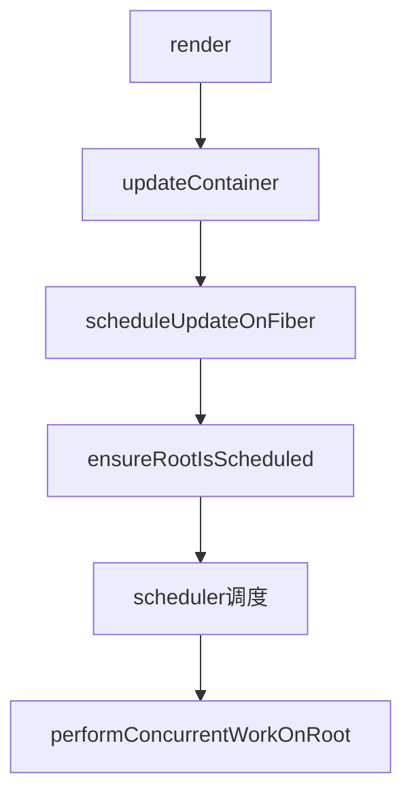

# React 初次更新过程 Initial Mount render

### React 调用render 流程细节分析

#### render
调用 ReactDOM 获取 `_internalRoot` （FiberRootNode）与 AppComponet（children）并调用 updateContainer函数:
`updateContainer(children, root, null, null);`

#### updateContainer：

- function signature:
`function updateContainer(element, container, parentComponent, callback)`

- 流程分析：
  - 获取当前时间（eventTime）`requestEventTime();`
  - 获取更新优先级（lane）`requestUpdateLane(current$1);`
  - 获取context： `getContextForSubtree(parentComponent);`
  - 创建更新对象： `createUpdate(eventTime, lane);`
  - 调用 `var root = enqueueUpdate(current$1, update, lane);` (FiberRootNode, 更新对象，lane) 将更新（update）加入指定组件的更新队列中。它主要负责处理 React Fiber 树中的状态更新，确保更新能够被调度并最终应用到组件上。
  - 调用 `scheduleUpdateOnFiber(root, current$1, lane, eventTime);`
  - 调用 `entangleTransitions(root, current$1, lane);` ： 用于处理 transition lanes（过渡通道）之间的 关联（entangling）。当一个新的过渡任务（transition）被添加到一个 Fiber 节点时，React 会通过这个函数将新任务的 lane 与其他过渡 lanes 进行关联，确保它们能够正确地一起调度和处理。

`var current$1 = container.current;`: HostRoot类型的 Fiber节点

#### scheduleUpdateOnFiber
- function signature: `function scheduleUpdateOnFiber(root, fiber, lane, eventTime)`
- 流程分析（不包含错误检测）：
  - `markRootUpdated(root, lane, eventTime);`:
    - 定义：负责在更新发生时将 根Fiber树（root）标记为已更新。这确保了 React 知道 Fiber 树上有工作需要处理，并且可以相应地安排更新。如果新的更新有可能解除阻塞，它还可以处理清理暂停的车道。
  - `ensureRootIsScheduled(root, eventTime);`

#### ensureRootIsScheduled

#### performConcurrentWorkOnRoot

#### renderRootSync

#### workLoopSync

#### performUnitOfWork

#### beginWork$1 -> beginWork
current is null

#### updateHostRoot

