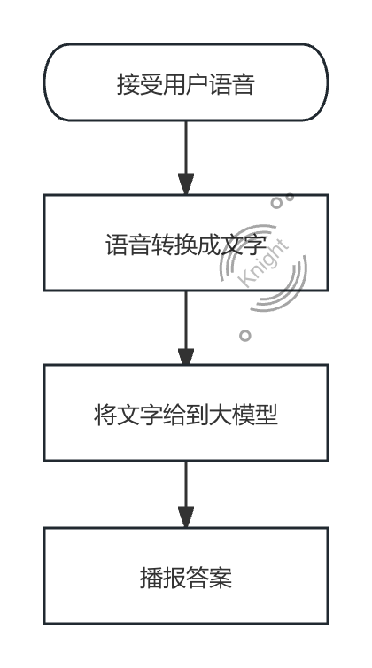
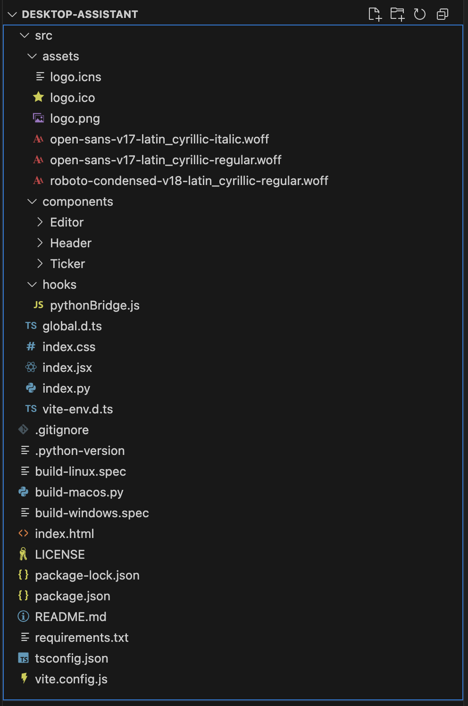
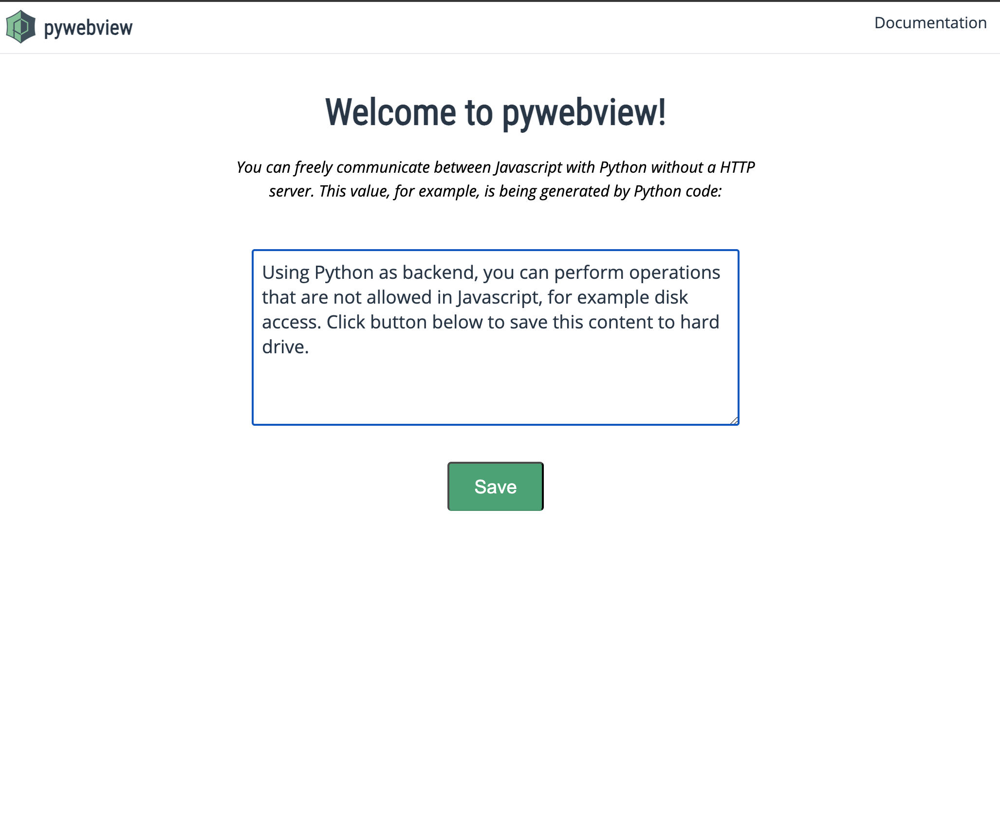

# 使用本地部署大模型打造个人语音助手

Hello 大家好， 我是程序员Knight。随着大模型的火热发展🔥，我开始思考如何通过完全本地部署的方式，让 AI 更贴近我们的日常生活。于是，我决定通过 本地桌面应用（Desktop App） 的形式，搭建一个个人语音助手。

话不多说，让我们一起探索如何实现这一想法吧！🚀

## 需求明确：
在开始前，我来用了一张图明确下整个App的核心功能和流程：

流程如下：
1.	用户点击 UI 按钮进行录音，松开按钮后生成语音文件。
2.	使用 语音转文字（Speech-to-Text） 技术将音频转换成文本。
3.	将文本输入到本地部署的大模型，获取 AI 生成的回答。
4.	通过 语音合成（Text-to-Speech） 技术，将 AI 回答转换为语音并播放。

整个过程简单流畅，目标是提供一个**完全离线的智能助手体验**。

## 技术实现：
接下来，我们直接进入技术实现部分，主要包括以下几个步骤：
1.	技术选型
2.	UI 设计与实现
3.	Python 逻辑开发


### 技术选型：
在技术方案上，我选择使用 Python 作为后端开发语言，主要因为 Python 拥有大量开箱即用的库，可以大幅降低开发成本。例如：
- 语音处理库： `soundfile, sounddevice` 👉 记录语音功能
- OpenAI Whisper 👉 处理语音转文字（STT）
- 语音合成（TTS） 👉 让 AI 说话

此外，桌面应用的实现方式有很多，我选择了 pywebview 这个库, pywebview 让我们可以用 Python 处理后端逻辑，HTML/CSS/JS 搭建前端 UI，结合两者的优势，能够快速实现一个功能完整的本地 AI 语音助手。原因如下：
- 基于 WebView，支持 HTML/CSS/JS 进行 UI 开发，灵活性更高
- 跨平台，支持 Windows、Mac、Linux
- 支持双向通信，可轻松实现 Python 与 JavaScript 交互
- 原生 WebView 组件，运行性能更优
- 后台运行，支持任务异步处理


#### 项目初始化：
在开始正式开发之前，我们需要先进行 项目初始化。为了让整个搭建过程更加高效，我们推荐使用 GitHub 上的[pywebview-react-boilerplate 样板文件](https://github.com/r0x0r/pywebview-react-boilerplate)这个模板已经帮我们集成了 Python + React + PyWebview，可以大幅减少基础配置的时间，让我们专注于功能实现！💡

⏬ 我们可以通过两个方式来下载这个文件：
- 使用 git clone 直接下载
- 直接下载 ZIP 并解压到本地

下载本地之后，其目录结构如下:


在正式开发之前，我们需要完成一些基础环境设置：

1️⃣ 创建 Python 虚拟环境
为了避免影响全局 Python 依赖，我们需要创建一个 独立的虚拟环境：
```bash
python -m venv virtualEnv  # 创建虚拟环境
source virtualEnv/bin/activate  # Mac/Linux 启动环境
virtualEnv\Scripts\activate  # Windows 启动环境
```
成功激活后，终端前面会出现 (virtualEnv)，表示你已进入虚拟环境。

2️⃣ 安装依赖
模板项目中已经包含了 前端（React）和后端（Python） 需要的所有依赖，我们只需要运行一个初始化指令：
```bash
npm run init # 前端初始化

pip install -r requirements.txt # python环境初始化
```

3️⃣ 启动开发环境

|  指令   | 作用  |
|  ----  | ----  |
| npm run start  | 运行桌面应用 |
| npm run dev  | 仅启动前端 UI 开发模式 |
| npm run build  | 打包成可执行应用 |


如果一切顺利，运行 npm run start 后，你应该会看到一个桌面应用界面，这意味着我们可以开始正式的 UI 和功能开发了！🎉



#### UI 开发：
首先让我们先进行前端的开发， 通过指令 `npm run dev`， 我们进入到 `localhost:3000` 就可以进行和平时一样的开发了。

**🎤 语音录制按钮**：
关于UI，我们只需要一个按钮来记录用户的录音行为即可，其实现也非常简单，通过 `mouse` 事件来模拟按住与释放的行为， ：

```jsx
import { memo } from 'react';
import { Button } from '@mui/material';

import styles from './index.module.css';

function RecordButton() {
    const startRecord = () => {
      // 🚀：后续换成python的开始录制API
      console.log("Recording...");
    };
  
    const stopRecord = () => {
      // 🚀：后续换成python结束录制的API
      console.log("Done Recording...");
    };
  
    return (
        <div className={styles.centerBtn}>
            <Button
                onMouseDown={startRecord}
                onMouseUp={stopRecord}
                onMouseLeave={stopRecord}
            >
                <span>🎙 录音</span>
            </Button>
        </div>
    );
}

export default memo(RecordButton);
```
在整体页面样式上，我则只是设置了背景色, 并且添加了Tooltip与 `react-wavify` 做了一个录音波浪的小动画；大家可以通过下载源码的方式来获取内容。有其他想法的小伙伴也可以在下方留言或者将项目下载到本地来修改～

我的实现效果如下：


**与python后端交互来进行录音和走之后的流程**：
`pywebview` 这个框架提供了双向通信的能力，对于使用者来说非常简单、友好。我们这里主要需要的是通过 JavaScript的按钮点击来通知到Python的程序要进行语音录制⏺️；这里一共需要三步:

1️⃣ 在 Python 程序 `webview.create_window` 时传入暴露给UI端的API。 
```python
class Api:
    def fullscreen(self):
        webview.windows[0].toggle_fullscreen()

    def stop_record(self, content):
        """从 GUI 触发停止录音"""
        stop_recording.set()

    def record(self, content):
        """从 GUI 触发录音"""
        stop_recording.clear()
        record_conference_audio()

window = webview.create_window('Knight的私人助理', entry, js_api=Api())
```

2️⃣ 通过window对象直接调用对应的 Python API：

最终JS实现如下：
```javascript
/** src/hooks/pythonBridge.js */
export function usePythonApi(apiName, apiContent) {
  window.pywebview.api = window.pywebview.api || {}
  window.pywebview.api[apiName](apiContent)
}

/** src/components/RecordButton/index.tsx */
import { memo, useState } from 'react';
import { Button, Tooltip } from '@mui/material';
import { usePythonApi } from '../../hooks/pythonBridge'

import Wave from 'react-wavify'

import styles from './index.module.css';

function RecordButton() {
    const [isRecording, setIsRecording] = useState(false);

    const startRecord = () => {
        usePythonApi('record', '');
        setIsRecording(true);
    };
  
    const stopRecord = () => {
        usePythonApi('stop_record', '');
        setIsRecording(false);
    };
  
    return (
        <div className={styles.centerBtn}>
            {/* 悬浮提示：引导用户按住录音 */}
            <Tooltip title="按住按钮开始录音，松开结束录音" arrow>
                <Button
                    className={styles.recordBtn}
                    onMouseDown={startRecord}
                    onMouseUp={stopRecord}
                    onMouseLeave={stopRecord}
                >
                    <span>🎙 录音</span>
                </Button>
            </Tooltip>

            {/* 录音波形动画（仅在录音时显示） */}
            {isRecording && (
                <Wave
                    fill="#1277b0"
                    paused={false}
                    options={{
                        height: 30,
                        amplitude: 30,
                        speed: 0.25,
                        points: 4,
                    }}
                    className={styles.wave}
                />
            )}
        </div>
    );
}

export default memo(RecordButton);
```


#### 🐍 python开发
在这一部分，我们将深入 Python 服务的实现，拆解语音助手的 核心功能模块：
  1.	语音录制 🎤
  2.	语音转文字（STT） 📝
  3.	调用大模型获取 AI 响应 🤖
  4.	将文本转换为语音播报（TTS） 🔊

虽然这个流程看起来涉及多个技术点，但实际上，我们可以使用 Python 的开源库 快速实现这些功能，并让整个过程流畅无阻！💡


##### ⚙️ 前置操作
在正式开发之前，我们需要安装一些关键工具：

1. 下载 `FFmpeg`, Mac电脑可以通过 `brew install ffmpeg`来下载：
   - FFmpeg 是一个强大的音视频命令行工具，可以为我们做音视频的转码、混流、嵌挂字幕、剪辑等工作。下载 `FFmpeg` 主要是为了语音翻译工具 `OpenAI Whisper` 可以正常工作。
```bash
brew install ffmpeg # mac
choco install ffmpeg # windows
sudo apt install ffmpeg # linux
```
2. Ollama: 为了在本地运行大模型, 我们使用 Ollama 作为 LLM 推理引擎; Ollama 让我们可以像调用 API 一样，在本地轻松运行大模型，无需依赖云端服务！🚀 [Ollama下载地址](https://ollama.com/download)


##### 🎤 录制功能开发
首先我们来看语音文件录制的python开发，在这里我们需要 `sounddevice + soundfile` 来实现。

✅ 使用 sounddevice 采集麦克风输入
✅ 使用 soundfile 存储录制的音频
✅ 采用后台线程处理录音，防止主线程阻塞

**📌 安装依赖**：
```bash
pip install sounddevice soundfile
```


**🚀 录音功能实现**
我们的录音功能主要通过**后台线程运行的方式**来录制音频并保存到文件中，这里选用线程主要是为了：
- 录制音频时，并不会造成堵塞。
- 确保了后台任务正常进行，如何意外中止或UI崩溃，也能正常进行流程。

这里的技术实现主要通过 python 内置的 `threading` 这个类来实现, 那么录音的停止也是通过线程的事件来通知给录制线程。实现如下：

```python
# 创建全局事件变量，控制录音的开始与停止
stop_recording = threading.Event()

# 给到GUI/前端的 API 定义
class Api:
    def stop_record(self, content):
        """从 GUI 触发停止录音"""
        stop_recording.set()

    def record(self, content):
        """从 GUI 触发录音"""
        stop_recording.clear()
        record_audio()
```


**record_audio() 函数实现**
我们先定义一些采样率、文件名称、声道与默认输入设备参数：
```python
def record_audio():
    """在新线程中运行录音"""
    def recording_thread():
        try:
            sample_rate = 16000  # 16kHz 采样率
            channels = 1         # 单声道
            device = None        # 使用默认输入设备

            # 动态命名音频文件
            filename = datetime.now().strftime("record%Y%m%d_%H%M%S.wav") 

            # 打开音频文件
            with sf.SoundFile(filename, mode='x', samplerate=sample_rate, channels=channels) as audio_file:
                
                def callback(indata, frames, time_info, status):
                    """实时音频数据回调函数"""
                    if status:
                        print(status, file=sys.stderr) # 错误处理
                    audio_file.write(indata.copy()) # 写入音频数据

                # 创建输入流
                with sd.InputStream(samplerate=sample_rate, device=device, channels=channels, callback=callback):
                    print(f"🎤 录音中... 文件将保存为：{filename}")
                    while not stop_recording.is_set(): # 当 `stop_recording` 事件被触发时停止录音
                        time.sleep(1)  # 维持主线程运行
            
            print("\n✅ 录音已停止")
            print(f"💾 文件已保存到：{filename}")

            # 在新线程中处理音频（翻译 -> 生成文本 -> 朗读）[后面会一一讲解每个步骤的实现]
            threading.Thread(target=process_audio, args=(filename,), daemon=True).start()

        except Exception as e:
            print(f"❌ 录音时发生错误: {e}")
    threading.Thread(target=recording_thread, daemon=False).start()
```


##### 🚀 STT语音转文字 — openAI whisper
语音录制结束后，我们已经有了用户的音频数据， 接下来我们只需要通过本地的 `OpenAI Whipser` 模型来实现语音转文字的操作；

Whisper模型是OPenAI在2022年发布的开源模型，Whisper 采用的是 Transformer 编码器-解码器架构，与 GPT 类似，但专门用于语音识别。它有几个核心的特点：
- 多语音支持
- 开源 & 免费使用
- 支持自动分句和语法优化
- 可适应 不同背景噪音、口音、语速变化，比传统语音模型更加稳定。
- 离线运行

缺点：
- whipser只支持30秒的音频输入, 对于长语音需要手动切片

**📌 安装依赖**：
```bash
pip install openai-whisper
```

**🚀 SST功能实现**
我们使用 Whisper 进行本地语音识别，并处理语音数据：
```python
class Translator:
    def __init__(self):
      # 通过 load_model 来进行初始化操作， 模型我们选择 turbo
      self.model = whisper.load_model("turbo")
    
    def translate(self, audio_path):
      # 加载音频，并裁剪或填充至 30 秒
      audio = whisper.load_audio(audio_path)
      audio = whisper.pad_or_trim(audio)

      # 由于神经网络不能直接理解音频波形，在这里转换为频谱图，方便提取语音特性。
      mel = whisper.log_mel_spectrogram(audio, n_mels=self.model.dims.n_mels).to(self.model.device)

      # 通过默认的配置解码音频，并返回文本
      options = whisper.DecodingOptions()
      result = whisper.decode(self.model, mel, options)
      return result.text
```


##### 🦙 对话大模型 Ollama
在本地部署大语言模型（LLM）时，我们需要一个高效、易用的工具来管理和运行这些模型。Ollama 能够在 CPU（x86 和 ARM） 以及 macOS 的 Apple Silicon（M1、M2、M3 芯片） 上高效运行大语言模型（LLM）。它简化了 LLM 的本地运行，让我们可以更方便地在桌面应用、服务器或嵌入式环境中使用。

Ollama 提供了以下能力：
- 轻量级的模型管理：可以轻松下载、更新和运行各种开源 LLM（如 LLaMA、Mistral、Gemma、Phi-2、Code Llama 等）。
- 高性能推理：针对 CPU 和 GPU 进行了优化，提供更快的推理速度。
- 本地 API 服务：通过 HTTP API 直接与本地模型交互，无需复杂的环境配置。[API文档](https://github.com/ollama/ollama/blob/main/docs/api.md)

**🚀 代码实现**
在本地启动 Ollama 后，我们可以直接通过 API的方式调用 LLM：
```python
def chat(prompt):
    try:
        deepSeek = hasDeepSeek()
        if (deepSeek['has']):
            reqobj = {
                "model": deepSeek['model'],
                "prompt": prompt,
                "stream": False # 一次性返回完整结果
            }
            response = requests.post("{MODEL_END_POINT}/api/generate".format(MODEL_END_POINT=MODEL_END_POINT), json=reqobj)
            respJson = response.json()
            if (respJson.get('response')):
                cleaned_text = clear_think(respJson['response'])
                return cleaned_text
            return "无输出"
        else:
            return {"error": "DeepSeek model not available"}
    except Exception as e:
        return {"error": e}
```


##### 📢 语音播报 pytssx3

pyttsx3 是 Python 中一个支持多平台的 文本转语音（Text-to-Speech, TTS） 库。它的最大特点是：
✅ 完全离线运行，不依赖互联网
✅ 跨平台支持（Windows、macOS、Linux）
✅ 可以控制语速、音量、语音引擎
✅ 支持不同的 TTS 引擎（如 SAPI5、nsss、espeak）

相较于 Google TTS（需要联网）和 pytts（更简单但功能少），pyttsx3 是一个功能更强大、灵活的离线 TTS 解决方案。

**📌 安装依赖**：
```bash
pip install pyttsx3
```

**🚀 实战时的问题**：
`pyttsx3` 的使用非常简单，初始化语音引擎后我们可以直接使用播报，但在项目中发现，如果直接调用语音播报方法后，语音结束后会直接退出应用程序。debug了半天怀疑是播报结束会直接退出应用程序，最后采用脚本调用的方式来运行语音播报。

**🚀 TTS功能实现**
Python播报脚本如下：
```python
import pyttsx3
import argparse
import sys

def speak(text):
    """使用 `pyttsx3` 朗读文本"""
    engine = pyttsx3.init(driverName="nsss")  # 适用于 macOS
    engine.setProperty('voice', "com.apple.speech.synthesis.voice.ting-ting.premium")
    
    engine.say(text)
    engine.runAndWait()
    engine.stop()  # 释放资源，避免 Python 进程卡住

if __name__ == "__main__":
    parser = argparse.ArgumentParser(description="文本转语音（TTS）")
    parser.add_argument("text", nargs="?", type=str, help="需要朗读的文本")
    
    args = parser.parse_args()

    if args.text:
      speak(args.text)
```

我们在调用时，通过 `subprocess.run(["python", '{first}/src/py_utils/broadcast.py'.format(first=os.getcwd()), text])`的方式来进行语音播报

🎯 现在，你的 AI 语音助手已经可以进行完整的语音交互！ 🚀🔥

## 写在最后

在本文中，我们探讨了如何利用 本地部署的大模型（如 Ollama） 结合 语音转文本（STT） 和 文本转语音（TTS） 技术，搭建一个 完全离线的 AI 语音助手。通过 pywebview 构建桌面 UI，Ollama 作为本地 LLM 推理引擎，再结合 Whisper 进行 STT 及 pyttsx3 处理 TTS，我们可以打造一个高效、安全、隐私友好的语音助手。

随着 AI 技术的发展，本地化 AI 方案正在成为趋势。未来，我们还可以探索 更流畅的 UI 交互、集成更多开源模型、优化 TTS 语音效果，甚至加入 个性化的 AI 记忆，打造真正属于自己的智能助手。🚀

如果你对这个项目感兴趣，欢迎交流分享你的想法！💡  我将项目放到[Git仓库](https://github.com/LHKong7/borderless-assistant)中，你也可以直接下载预览和完善自己的语音助手～

🎯 你的 AI，不止是工具，更是伙伴！ 💬🔥

